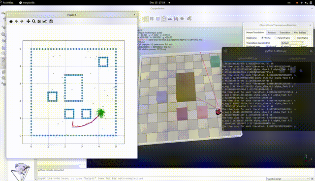

## AI3603 2021 Fall(人工智能理论与应用)

This repo contains the three lab3 of SJTU AI3603, taught by Prof Gao. Each lab can be complete this homework individually or in a group of two. 

* [x] Lab1: Search Problem
* [x] Lab2: Reinforcement Learning
* [x] Lab3: Particle Filter
* [ ] Final Project: chosen by yourself, we select `dance_with_music` (~~别问，问就是没做~~)
 
### Homework Requests & Enviroment
You can see the homework requests and how to set up enviroment of each lab in `AI3603_HW*/1-HW*_assignment.pdf`. 

### Some Demos

#### Lab1: Hybrid A* algorihtm

#### Lab2: ucb algorithm

#### Lab3: ACML algorithm

